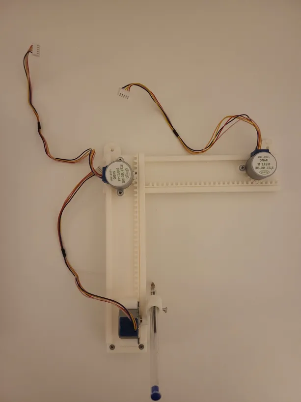
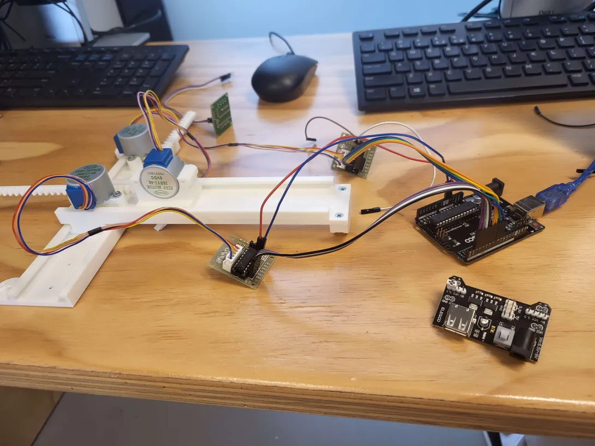
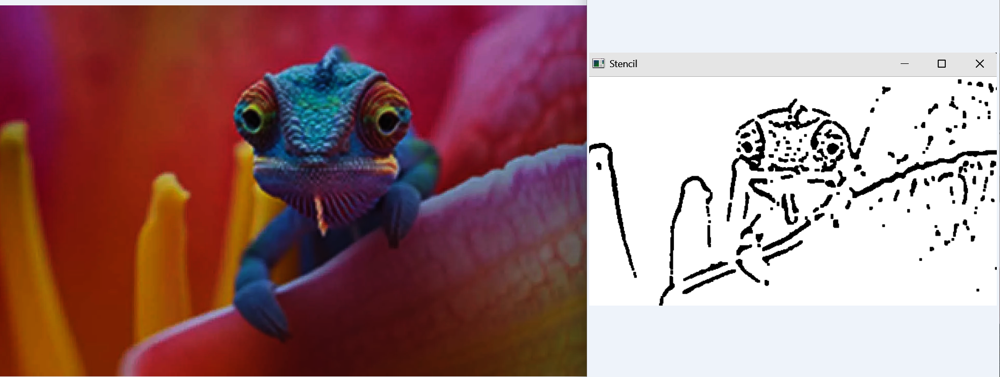
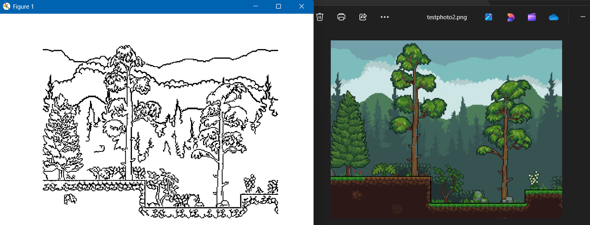

# 🖊️ CNC Pen Plotter

A CNC pen plotter built from scratch using 3D-printed parts, stepper motors, and an Arduino — capable of converting images into physical sketches by extracting outlines through computer vision and drawing them autonomously.

> Built as a school project bridging engineering and code.

---
## 🎥 Demo

https://github.com/user-attachments/assets/55d4b473-c7b8-4314-91f3-ab1adc4a8412

## 📸 Gallery

| Hardware | Mounted |
|----------|---------|
|  |  |

| Input → Outline (Chameleon) | Input → Outline (Terraria) |
|-------------|------------------|
|  |  |

---

## 🎯 Project Goals

| Stage | Goal | Status |
|-------|------|--------|
| ✅ Initial | Draw a polygon with the pen plotter | Complete |
| ✅ Secondary | Convert an image with clear outlines into a sketch and draw it | Complete |
| 🔄 Final | Convert complex images with unclear outlines into a sketch | Partial |

---

## ⚙️ How It Works

1. **Image Processing** — A Python script uses OpenCV to extract the outlines of an input image using edge detection and adaptive thresholding
2. **Vectorisation** — The outlines are converted into coordinate vectors
3. **Motor Instructions** — The vectors are translated into step-by-step motor movement commands
4. **Drawing** — The Arduino sends signals to the stepper motor drivers, which move the pen across the paper

---

## 🛠️ Hardware Components

| Component | Quantity | Role |
|-----------|----------|------|
| Arduino | 1 | Sends instructions to motor drivers |
| Stepper Motor (5VDC) | 2 | Controls X and Y axis movement |
| ULN2003 Driver Module | 2 | Controls the stepper motors |
| Servo Motor SG90 | 1 | Lifts and lowers the pen |
| Breadboard | 1 | Connects all components |
| 9V Battery | 1 | Power supply |
| 3D Printed Frame | — | Structural chassis for the plotter |

---

## 💻 Software

The image processing pipeline is written in **Python** using:
- `OpenCV` — edge detection, adaptive thresholding, noise filtering
- `NumPy` — image array manipulation
- `Matplotlib` — preview output before plotting
